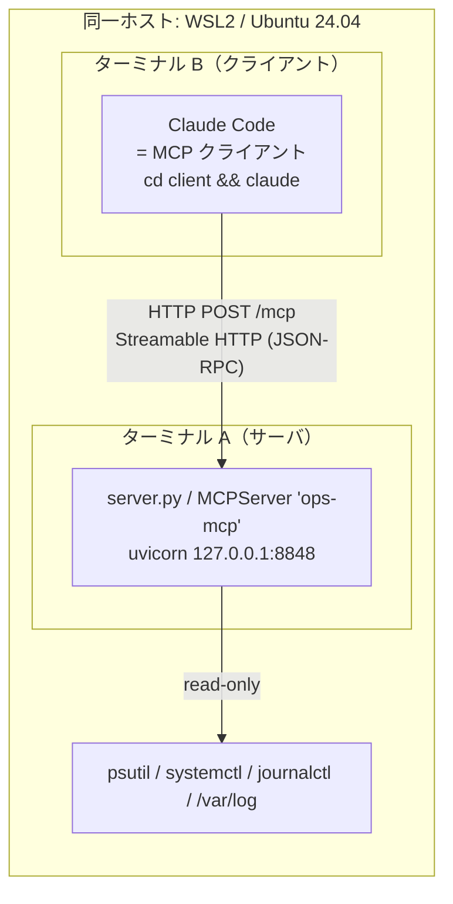
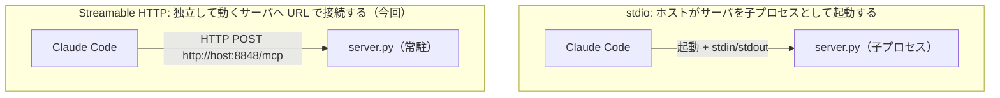
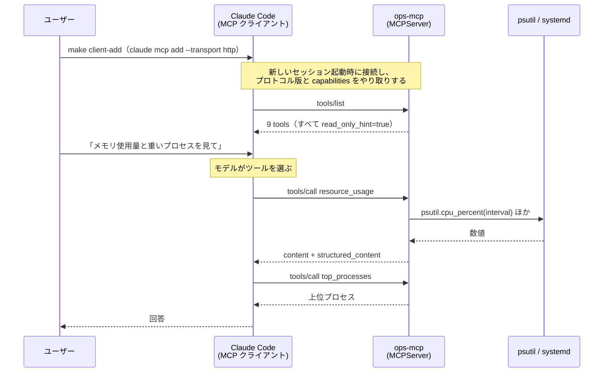
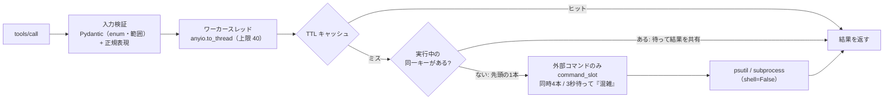

# 全体アーキテクチャ

MCP サーバ（`server/`）と、それに繋ぐ Claude Code（`client/` の設定）の全体仕様。
図は Mermaid（GitHub / VS Code のプレビュー等で描画）。描画できない環境向けに §1 だけ ASCII 版も併記する。

> 図の Mermaid 記法はこの環境では描画確認できていません（構文は標準的なものだけを使用）。
> 描画が崩れる場合は ASCII 版と表を正としてください。

## 1. 配置図 — どこで何が動くか



```
┌─ 同一ホスト: WSL2 / Ubuntu 24.04 ───────────────────────────────────────────┐
│                                                                             │
│  ターミナル B                              ターミナル A                     │
│  ┌─────────────────────┐   HTTP POST /mcp  ┌──────────────────────────┐    │
│  │ Claude Code         │ ────────────────▶ │ server.py                │    │
│  │  = MCP クライアント │  (JSON-RPC)       │ MCPServer "ops-mcp"      │    │
│  │ cd client && claude │ ◀──────────────── │ uvicorn 127.0.0.1:8848   │    │
│  └─────────────────────┘                   └────────────┬─────────────┘    │
│                                                         │ read-only        │
│                                            ┌────────────▼─────────────┐    │
│                                            │ psutil / systemctl /     │    │
│                                            │ journalctl / /var/log    │    │
│                                            └──────────────────────────┘    │
└─────────────────────────────────────────────────────────────────────────────┘
```

同じホスト上の**別プロセス同士が HTTP で会話している**のがポイント。
接続先の URL とサーバの待受アドレスを変えれば、そのまま別マシンへ広げられる（[`client/docs/02-remote-host.md`](../client/docs/02-remote-host.md)）。

## 2. stdio との対比（MCP を理解する一番のポイント）



| | stdio | Streamable HTTP（今回） |
|---|---|---|
| サーバの起動 | Claude が起動する | **先に自分で起動しておく**（`make start`） |
| 寿命 | Claude セッションと同じ | Claude と独立。複数のクライアントが同時に使える |
| 登録 | `claude mcp add NAME -- <起動コマンド>` | `claude mcp add --transport http NAME <URL>` |
| 別マシンから | 不可（同一マシンの子プロセス） | 可能（URL を変える） |
| 認証 | 不要（親子プロセス） | 要検討。**本トライアルは認証なし** |

## 3. 接続からツール実行まで



> **並列呼び出しについて**: モデルの判断で複数ツールを同時に呼ぶことがある。ただし実測した1回の実行
> （`claude -p`）では**逐次**だった。並列でも、複数端末からの同時接続でも同じサーバ側の対策
> （§6 / [`server/docs/04-concurrency.md`](../server/docs/04-concurrency.md)）で守られる。

## 4. プロトコルの正体 — 素の curl で `tools/list` を叩く

MCP over HTTP は「JSON-RPC を POST するだけ」。実際に通った最小例（サーバ起動中に実行できる）:

```bash
curl -sS -X POST http://127.0.0.1:8848/mcp \
  -H 'Content-Type: application/json' \
  -H 'Accept: application/json, text/event-stream' \
  -H 'MCP-Protocol-Version: 2026-07-28' \
  -H 'Mcp-Method: tools/list' \
  -d '{"jsonrpc":"2.0","id":1,"method":"tools/list","params":{"_meta":{"io.modelcontextprotocol/protocolVersion":"2026-07-28","io.modelcontextprotocol/clientCapabilities":{}}}}'
```

- `Mcp-Method` ヘッダは本文の `method` と**一致**が必須（不一致は `-32020`）
- `params._meta` に `protocolVersion` と `clientCapabilities` が必須（無いと `-32602`）
- 2026-07-28 のプロトコルは**セッションレス**: `initialize` も `Mcp-Session-Id` も不要で、1リクエストで完結する
- 素の GET は `400 Missing session ID`（レガシー系のセッション前提の応答）
- 偽の `Host` ヘッダは `421 Invalid Host header`（DNS リバインド保護）

`client/scripts/check_reachable.sh` はこの形で到達性を確認している。

## 5. 公開インターフェース

サーバ名 `ops-mcp`。全ツール `read_only_hint=true`。引数・戻り値・エラーの詳細は [`server/docs/02-tools-spec.md`](../server/docs/02-tools-spec.md)。

| 種別 | 名前 | 概要 |
|---|---|---|
| tool | `system_overview` | ホスト名・OS・カーネル・起動時刻・uptime・CPU数・ロードアベレージ |
| tool | `resource_usage` | CPU（全体/コア別）・メモリ・スワップ |
| tool | `disk_usage` | 指定パスと全マウントの容量 |
| tool | `top_processes` | CPU / メモリ上位のプロセス |
| tool | `listening_ports` | LISTEN 中の TCP ソケット |
| tool | `service_status` | systemd ユニットの状態 |
| tool | `tail_log` | 許可リスト（syslog/auth/kern/dmesg）の末尾 |
| tool | `journal_recent` | systemd ジャーナルの直近エントリ |
| tool | `server_stats` | サーバ自身の並行制御カウンタ（重複排除の効果を観測する用） |
| resource | `ops://host` | ホスト情報（JSON） |
| resource | `ops://logs` | 閲覧できるログの一覧 |
| resource template | `ops://logs/{name}` | 許可リストのログ末尾100行 |
| prompt | `health_check` | ホストの健康状態を総合点検 |
| prompt | `investigate_load` | 負荷の原因調査 |

Tools は**モデルが呼ぶ**、Resources は**アプリが読み込む**、Prompts は**ユーザーが選ぶ**、という役割分担（[`90-mcp-notes.md`](90-mcp-notes.md)）。

## 6. サーバ内部 — 1リクエストの通り道



| 層 | 役割 | 実装 |
|---|---|---|
| 入力検証 | 不正入力を実行前に弾く（注入・範囲外） | `server.py` の型 / `ops/collectors.py` の `UNIT_RE` |
| スレッド実行 | ブロッキング処理でイベントループを止めない | SDK が同期 `def` を `anyio.to_thread` で実行 |
| TTL + single-flight | 重複計測の排除（時間方向 + 同時方向） | `ops/concurrency.py` の `Coalescer` |
| command_slot | 外部コマンドの同時数を制限し、溢れたら明示的に断る | `ops/concurrency.py` |

## 7. リポジトリ構成と責務

```
poc_mcp/
├── Makefile, README.md      入口
├── docs/                    両者共通（このファイル, 90-mcp-notes.md）
├── server/                  サーバ側だけで自己完結: 「何を公開し、どう動かすか」
│   ├── server.py            MCPServer 定義・起動
│   ├── ops/                 collectors.py（OS から集める）/ concurrency.py（並行制御）
│   ├── config/  scripts/  docs/  Makefile  pyproject.toml
└── client/                  クライアント側だけで自己完結: 「どこに繋ぎ、どう登録するか」
    └── config/  scripts/  docs/  Makefile        （Python 不要。要: claude, curl, make）
```

- `server/` にクライアントの都合は書かない。`client/` にサーバ実装の詳細は書かない。
- 両者の共有事項（エンドポイント `/mcp`、トランスポート、ツール名）は本ファイルが正。
- `client/` 一式は、別端末にコピーして `MCP_SERVER_URL` を書き換えれば同じ手順で使える。

## 8. 信頼境界とセキュリティ

| 論点 | 対応 |
|---|---|
| 書き込み・再起動・削除 | **ツールを作らない**（全 read-only。`read_only_hint=true` は宣言でありセキュリティ機構ではない） |
| コマンド注入 | `subprocess` は `shell=False` + 引数配列。ユニット名は `^[A-Za-z0-9][A-Za-z0-9@.:_\-]{0,127}$`（先頭 `-` 禁止でオプション注入も防ぐ） |
| パストラバーサル | ログは**許可リストのキー**でのみ指定。パス文字列を受け取らない |
| 待受アドレス | 既定 `127.0.0.1`。外に開くには `MCP_HOST` と `MCP_ALLOWED_HOSTS` の両方が必要 |
| DNS リバインド | SDK 既定の Host allowlist（localhost）。外に開くときは明示（[`client/docs/02-remote-host.md`](../client/docs/02-remote-host.md)） |
| 認証 | **なし**。ローカル/LAN 内のトライアル専用。公開するなら SDK の `run/authorization` を参照 |
| エラー内容 | 想定外の例外は一般化してクライアントへ返し、詳細はサーバログだけに残す |
| **ログ本文は外部入力** | syslog / journal には外部由来のテキストが入りうる。モデルに渡る**プロンプトインジェクションの経路**になりうるので、Claude が書き込み可能な他のツール（他の MCP や Bash 等）を持つセッションでは扱いに注意。制御文字（ANSI エスケープ等）は除去している |
| `auth` ログ | ログイン試行・sudo の記録が含まれる。許可リストから外したい場合は `ops/collectors.py` の `LOG_ALLOWLIST`（と `server.py` の `LogName`）から消す |

## 9. 設計判断の記録

| 判断 | 理由 |
|---|---|
| stdio ではなく HTTP | 主目的が「別プロセス・別端末から繋ぐ」だから。stdio との対比も学びになる |
| 題材を read-only に限定 | 書き込み競合を設計上ゼロにでき、認証なしのトライアルでも被害が限定的 |
| ハンドラは `def`（`async def` にしない） | SDK がスレッドで実行するのでイベントループが止まらない。`async def` 内で blocking を呼ぶと**全クライアントが止まる** |
| 既定の待受は `127.0.0.1` | 認証がないので、外に開くのは明示的な操作に限る |
| Windows を挟まず Linux ↔ Linux | ファイアウォール・PowerShell 等 MCP と無関係な障害を排除し、MCP の理解に集中するため |
| 依存管理は uv、操作は make | 再現性（`uv.lock`）と、コマンドの入口の一本化 |
